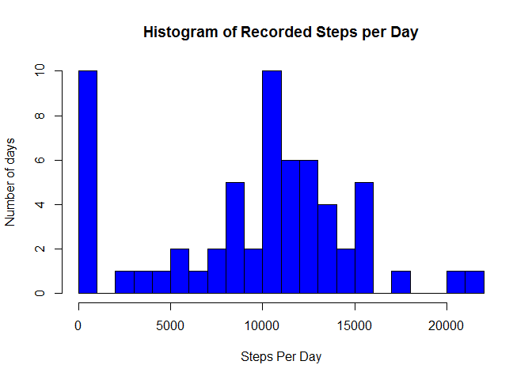
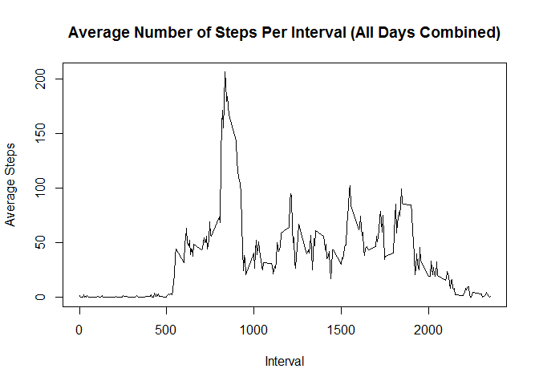
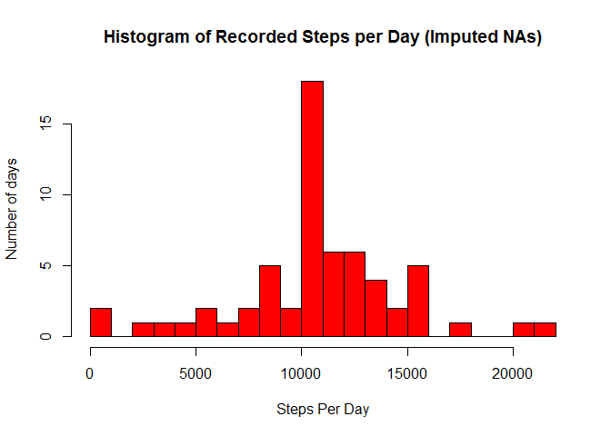

# An Exploratory Analysis of Wearable Fitness Step Tracking Data
#Introduction

This document is a summary of some exploratory analysis of wearable fitness data that tracks steps by day in 5 minute increments.  The dplyr package was used to perform most of the analysis and transformations as required.


```
## 
## Attaching package: 'dplyr'
```

```
## The following objects are masked from 'package:stats':
## 
##     filter, lag
```

```
## The following objects are masked from 'package:base':
## 
##     intersect, setdiff, setequal, union
```

After setting the working directory to the project directory, the first task was reading in the data into a data frame named fitdata.  This was accomplished with the following R code:


```r
fitdata <- read.csv("activity.csv")
```

Once the data is available, I chose to use the dplyr package to perform the transformations and summary data analysis.  A nice dplyr summary can be found [here.](https://cran.rstudio.com/web/packages/dplyr/vignettes/introduction.html)  I used dplyr to create three data frames:
* **fitdatabydate** which sums steps by date
* **fitdatabyinterval** which averages the number of steps taken in each observed interval
* **fitdata_nafill** which uses the **fitdatabyinterval** average to fill in any interval which had NA recorded in the steps feature.

Here is the code creating the three data frames:


```r
require(dplyr)
# Sum up the steps taken per day
fitdatabydate <- summarise(group_by(fitdata, date), tot_steps = sum(steps, na.rm = TRUE)) 

# Calculate the mean number of steps taken during each interval in the data set
fitdatabyinterval <- summarise(group_by(fitdata, interval), mean_steps = mean(steps, na.rm = TRUE)) 

#join the interval mean data set to the original fitness data
fitdata_nafill <- left_join(fitdata, fitdatabyinterval, by = "interval")

#replace any NA values with the mean value for that interval
fitdata_nafill$steps[is.na(fitdata_nafill$steps)] <- fitdata_nafill$mean_steps
```

```
## Warning in fitdata_nafill$steps[is.na(fitdata_nafill$steps)] <-
## fitdata_nafill$mean_steps: number of items to replace is not a multiple of
## replacement length
```


Now that the data has been transformed, some exploratory analysis can be conducted.  Here is a histogram of the total number of steps taken per day


```r
hist(fitdatabydate$tot_steps, breaks = 30, col = "blue", xlab = "Steps Per Day", ylab = "Number of days", main = "Histogram of Recorded Steps per Day")
```

\

Calculating the mean and median of steps per day,  and max steps interval, use:


```r
mean(fitdatabydate$tot_steps, na.rm = TRUE)
```

```
## [1] 9354.23
```

```r
median(fitdatabydate$tot_steps, na.rm = TRUE)
```

```
## [1] 10395
```

```r
filter(fitdatabyinterval, mean_steps == max(mean_steps))
```

```
## Source: local data frame [1 x 2]
## 
##   interval mean_steps
##      (int)      (dbl)
## 1      835   206.1698
```

#Analyzing Average Daily Patterns

To analyze the average daily patterns, I created the **fitdatabyinterval** dataset.  Using the following code, the time series for the data set is:


```r
plot(x = fitdatabyinterval$interval, y = fitdatabyinterval$mean_steps, type = "l", main = "Average Number of Steps Per Interval (All Days Combined)", xlab = "Interval", ylab = "Average Steps")
```

\


#Imputing Missing Values

A quick check of the data reveals there are numerous NAs in the data.

```r
num_nas <- sum(is.na(fitdata$steps))
```

I chose to replace the NA values with the mean for that specific interval.  I did this by using the merging the summary dataframe fitdatabyinterval with the fitdata detailed dataframe.  Using the imputed data, we can now compare it to the source data, first with a histogram and then by comparing the mean and median values of steps per day as well as total steps per day


```r
fitdata_nafill <- left_join(fitdata, fitdatabyinterval, by = "interval")
fitdata_nafill$steps[is.na(fitdata_nafill$steps)] <- fitdata_nafill$mean_steps
```

```
## Warning in fitdata_nafill$steps[is.na(fitdata_nafill$steps)] <-
## fitdata_nafill$mean_steps: number of items to replace is not a multiple of
## replacement length
```

```r
#Generate a histogram of the dataframe with imputed values
fitdata_imputed_bydate <- summarize(group_by(fitdata_nafill, date), tot_steps = sum(steps))
hist(fitdata_imputed_bydate$tot_steps, breaks = 30, col = "red", xlab = "Steps Per Day", ylab = "Number of days", main = "Histogram of Recorded Steps per Day (Imputed NAs)")
```

\

```r
ImputedChange_dailymean <- mean(fitdata_imputed_bydate$tot_steps) - mean(fitdatabydate$tot_steps, na.rm = TRUE)
ImputedChange_dailymedian <- median(fitdata_imputed_bydate$tot_steps) - median(fitdatabydate$tot_steps, na.rm = TRUE)

#Create a data frame to compare daily changes in step totals after imputing values
ImputedChange_dailytotalsteps <- inner_join(fitdatabydate,fitdata_imputed_bydate,by="date")
```

#Compare Weekdays to Weekends

Lastly, compare weekday to weekend patterns.  There is a noticeable difference in the latter part of the day with higher activity associated in the afternoon on weekends.


```r
fitdata_nafill$isweekend <- weekdays(as.Date(fitdata_nafill$date)) %in% c("Saturday","Sunday")
#fitdata_nafill$isweekend[weekdays(as.Date(fitdata_nafill$date)) %in% c("Saturday","Sunday")] = "Weekend"
fitdata_nafill$isweekend[fitdata_nafill$isweekend==TRUE] <- as.character("weekend")
fitdata_nafill$isweekend[fitdata_nafill$isweekend!="weekend"] <- "weekday"
df_weekdays <- summarise(group_by(fitdata_nafill, interval, isweekend), mean_steps = mean(steps))

ggplot(df_weekdays, aes(interval, mean_steps)) + geom_line() + facet_grid(isweekend ~ .)
```

\

```r
#df_weekends <- filter(fitdata_nafill, isweekend == "weekend")
#df_weekends <- summarise(group_by(df_weekends, interval), mean_steps = mean(steps))


#par(mfrow=c(2,1))
#plot(x = df_weekdays$interval, y = df_weekdays$mean_steps, type = "l", main = "Average Steps Per Interval (Weekdays)", xlim = c(0,2500), ylim = c(0,300))
#plot(x = df_weekends$interval, y = df_weekends$mean_steps, type = "l", main = "Average #Steps Per Interval (Weekend)", xlim = c(0,2500), ylim = c(0,300))
```

